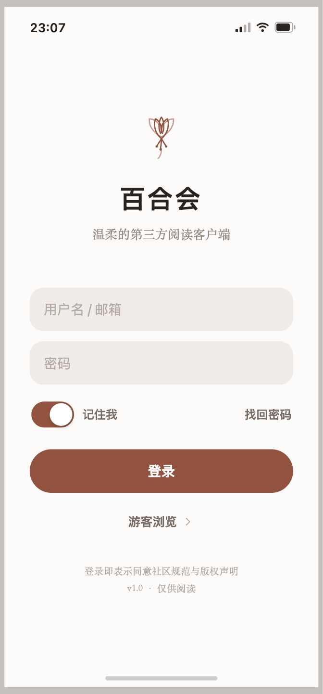
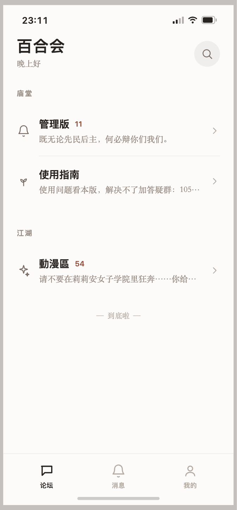
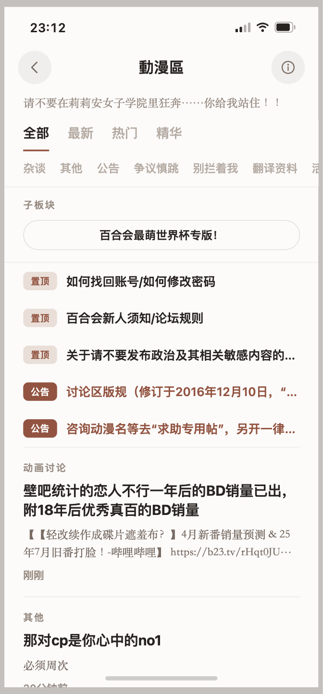
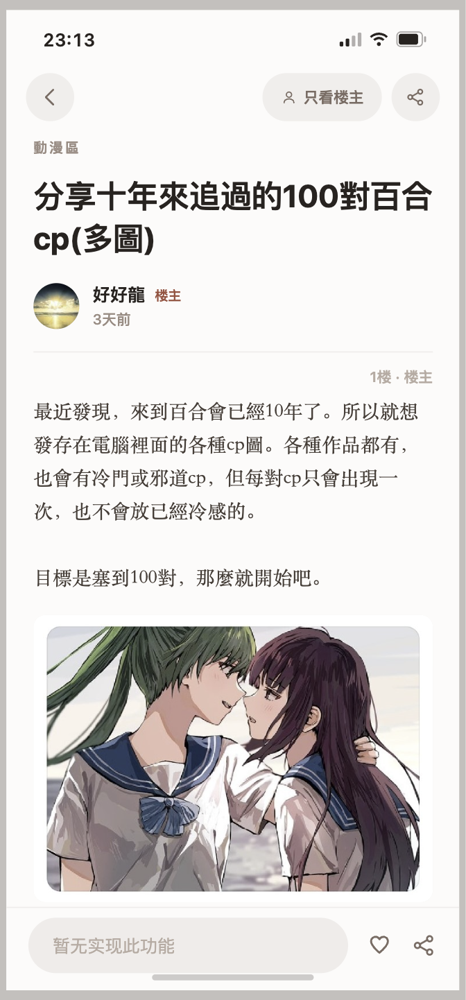
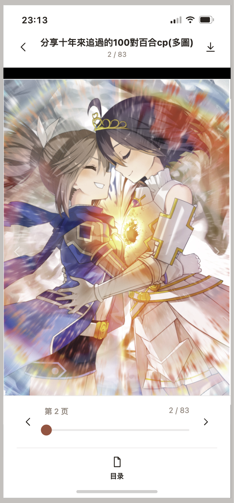

# yamibo-m · 百合会移动端客户端

百合会论坛（[bbs.yamibo.com](https://bbs.yamibo.com)）的**非官方第三方移动端客户端**，基于 Expo / React Native / TypeScript 构建。

> ⚠️ **免责声明**：本项目为非官方个人项目，与百合会官方无任何隶属或合作关系。
> 客户端通过论坛内置的 Discuz! 移动 JSON API 获取数据；第三方客户端调用论坛 API

## 功能特性

- **登录与游客浏览** —— 账号密码登录、登录态持久化与冷启动恢复，未登录也可浏览
- **板块与帖子浏览** —— 论坛首页板块树、板块帖子列表（标签筛选 / 下拉刷新 / 上拉加载）
- **帖子详情** —— 富文本（正文 / 图片 / 引用 / 表格 / 链接）渲染、帖内大图查看、分页跳转、楼层定位、只看楼主
- **个人主页** —— 查看自己与他人资料、积分维度
- **消息** —— 提醒与私信会话列表（只读）、底部未读角标
- **我的收藏** —— 浏览收藏、收藏 / 取消收藏
- **浏览历史** —— 本地记录最近浏览的帖子
- **主题** —— 浅 / 深色一键切换并记忆

## 界面预览

| 登录 | 论坛首页 | 板块帖子 | 帖子详情 | 图片查看 |
|:---:|:---:|:---:|:---:|:---:|
|  |  |  |  |  |

## 技术栈

Expo + React Native + TypeScript，消费 Discuz! X3.5 论坛内置的移动 JSON API
（`/api/mobile/index.php?version=4&module=...`），无需自研后端或爬虫。鉴权基于
Cookie（`auth` + `saltkey`）。当前主要目标平台为 **Android**，Web 用于开发验证。

## 快速开始

```bash
npm install

# Web 验证（需同时开两个终端）：
npm run proxy      # 终端 1：本地 CORS + Cookie 代理（:8089）
npm run web        # 终端 2：浏览器 375×812 设备视口（:8085）

# Android dev build（本地打包，原生直连论坛，无需代理）：
npm run build:dev  # prebuild + gradle 打 dev client 装到已启动的模拟器/已连接真机
npm run android    # 之后日常只跑 Metro；纯 JS 改动无需重新打包

# 多台设备同时在线时指定目标：
# APP_VARIANT=development npx expo run:android --no-bundler --device <AVD名或设备名>
# 或把产物装到指定真机：adb -s <serial> install -r android/app/build/outputs/apk/debug/app-debug.apk

# Dev build 使用独立包名 com.yamibo.reader.dev 和蓝色图标，可与正式版同时安装。
# android/ 目录是 prebuild 生成物（已 gitignore）；改了 app.config.js/原生依赖/patches 后
# 删掉 android/ 重新 npm run build:dev，避免带着旧配置增量构建。

# 云构建备用（无本地环境时）：npm run build:dev:eas

# 如需临时用 Expo Go 验证非原生模块页面：
npm run android:go
```

> Web 端需要代理，是因为浏览器有跨域（CORS）限制且禁止脚本设置 `Cookie` 头；
> `tools/proxy.js` 在本地把 JSON 请求转发到论坛并维护 Cookie。Android 原生直连、由系统管理登录态，无需代理。

## 文档

| 文档 | 内容 |
|---|---|
| [docs/API.md](docs/API.md) | 接口文档：Discuz 移动 API 鉴权、各模块请求 / 响应、URL 规则 |
| [docs/ROADMAP.md](docs/ROADMAP.md) | 路线图：v1 已完成功能、v2 写操作与后续计划、已知技术债 |
